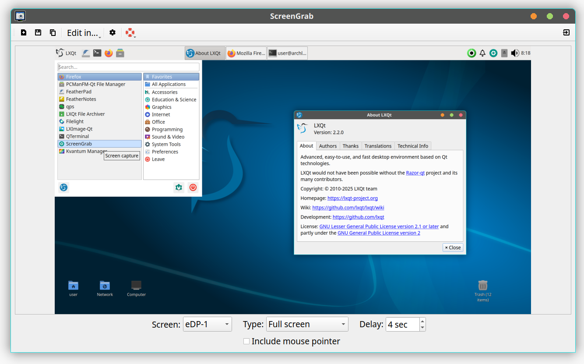

# ScreenGrab

## Overview

An application for creating screenshots. ScreenGrab uses the Qt framework and thus,
it is independent from any desktop environment.



## Features

* Screenshot of screen area, window, fullscreen and last selected area
* Delay
* Edit directly in other applications
* Automatic saving; insert date+time in filename
* Fit to edges by right click
* Custom shortcuts

## Installation

### Compiling source code

#### Build requirements

 * Qt5 >= 5.15
 * CMake >= 3.1.0 (only for building ScreenGrab from sources)
 * GCC > 4.5
 * KF5WindowSystem
 * [lxqt-build-tools](https://github.com/lxqt/lxqt-build-tools)

To build ScreenGrab from sources, use these commands:

	mkdir build
	cd build
	cmake [BUILD OPTIONS] ../
	make
	make install

#### Build options

You can use some or all of these parameters to customise your build.

 * **-DCMAKE_INSTALL_PREFIX** - Install prefix for Linux distro. Default setting: "/usr".
 * **-DSG_XDG_CONFIG_SUPPORT** - Place config files into XDGC_CONFIG_HOME directory
(usually - ~/.config/${app_name) ). Default setting: ON. In previous versions the
config files were stored in ~/.screengrab (Set this parameter to "OFF" to store the config files here).
 * **-DSG_EXT_UPLOADS** - Enable uploading screenshots to image hosting services. Default setting: ON.
 * **-DSG_DBUS_NOTIFY** - Enable D-Bus notifications.
 * **-DSG_GLOBALSHORTCUTS** - Enable global shortcuts for main actions to create screenshots. Default setting: ON.
 * **-DSG_USE_SYSTEM_QXT** - Use system version Qxt Library for global shortcuts. Default setting: OFF.
 * **-DSG_DOCDIR** - Name for the directory of user's documentation. Default setting:  "screengrab".
 * **-DQKSW_SHARED** - Enable shared linking with qkeysequencewidget library (in src/common/qksysekwesewidget).
Dfault setting: OFF.
 * **-DDEV_VERSION** - Set a dev-version here, maybe git describe $foo. Default not set.

#### Build notes

For Debian based Linux distributions please use the distribution build tools. One can get the source-code with
```
apt source screengrab # Sources for the released package
- or -
git clone https://salsa.debian.org/lxqt-team/screengrab
```
Build with the tools provided by `devscripts` or better with `pbuilder` or `sbuild`

### Binary packages

Official binary packages are available in all major distributions. Just use the distributions'
package manager to search for string 'screengrab'.

## LICENSE

ScreenGrab is licensed GPLv2+. The LICENSE file in the docs directory has more info.


## Copyright

(c) 2014–2021, LXQt Project  
(c) 2009–2013, Artem 'DOOMer' Galichkin

## Translation

Translations can be done in [LXQt-Weblate](https://translate.lxqt-project.org/projects/lxqt-desktop/screengrab/)

<a href="https://translate.lxqt-project.org/projects/lxqt-desktop/screengrab/">

</a>

