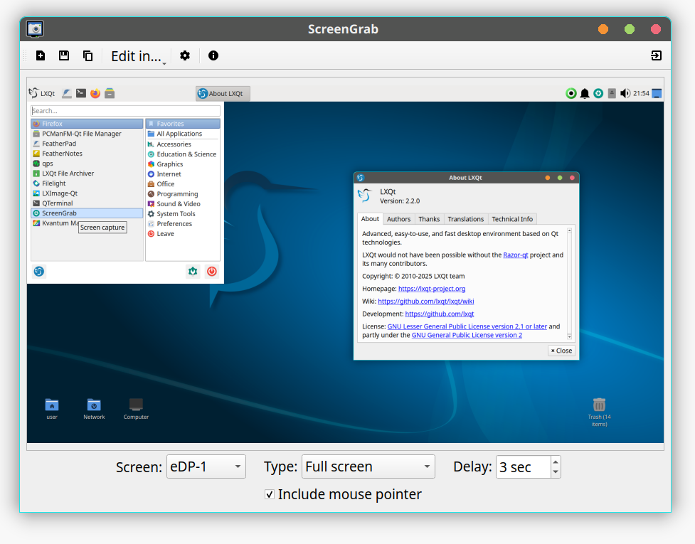

# ScreenGrab

## Overview

An application for creating screenshots for X11 and Wayland (using wlr-screencopy-unstable-v1). ScreenGrab uses the Qt framework and thus, it is independent from any desktop environment.



## Features

* Screenshot of screen area, window (X11 only), fullscreen and last selected area
* Screen selection (Wayland only)
* Delay
* Edit directly in other applications
* Automatic saving; insert date+time in custom filename
* Copy file name or full path to clipboard
* Fit to edges by right click (X11 only)
* Custom shortcuts
* Command line options

## Installation

### Compiling source code

#### Build requirements

 * Qt6 >= 6.6
 * CMake >= 3.18.0
 * GCC > 4.5
 * KF6WindowSystem (for X11 support)
 * qt6-wayland >= 6.6 (for Wayland support)
 * layershell-qt >= 6 (for Wayland support)
 * [lxqt-build-tools](https://github.com/lxqt/lxqt-build-tools)
 * [libqtxdg](https://github.com/lxqt/libqtxdg/)(if compiled with the ability to edit
 screenshots in external apps, which is the case by default)

To build ScreenGrab from sources, use these commands:

	mkdir build
	cd build
	cmake [BUILD OPTIONS] ../
	make
	make install

#### Build options

You can use some or all of these parameters to customise your build.

 * **-DCMAKE_INSTALL_PREFIX** - Install prefix for Linux distro. Default setting: "/usr".
(usually - ~/.config/${app_name) ). Default setting: ON. In previous versions the
config files were stored in ~/.screengrab (Set this parameter to "OFF" to store the config files here).
 * **-DSG_DBUS_NOTIFY** - Enable D-Bus notifications.
 * **-DSG_DOCDIR** - Name for the directory of user's documentation. Default setting:  "screengrab".
Dfault setting: OFF.
 * **-DDEV_VERSION** - Set a dev-version here, maybe git describe $foo. Default not set.

#### Build notes

For Debian based Linux distributions please use the distribution build tools. One can get the source-code with
```
apt source screengrab # Sources for the released package
- or -
git clone https://salsa.debian.org/lxqt-team/screengrab
```
Build with the tools provided by `devscripts` or better with `pbuilder` or `sbuild`

### Binary packages

Official binary packages are available in all major distributions. Just use the distributions'
package manager to search for string 'screengrab'.

## LICENSE

Screengrab is licensed under the GPL v2. See file LICENSE in docs directory for more information


## Copyright

(c) 2014-2025, LXQt Team
(c) 2009-2013, Artem 'DOOMer' Galichkin

## Translation

Translations can be done in [LXQt-Weblate](https://translate.lxqt-project.org/projects/lxqt-desktop/screengrab/)

<a href="https://translate.lxqt-project.org/projects/lxqt-desktop/screengrab/">

</a>

